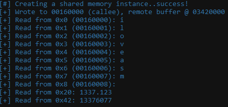
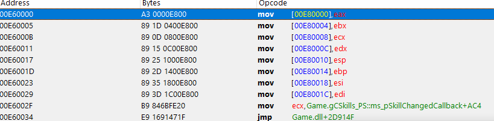
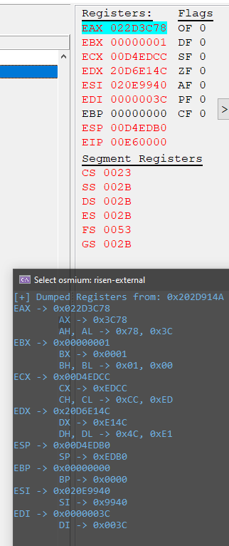

# **osmium**
**The following content may change frequently due to the updates of the framework and might be not up2date at all times.**


# **Table of Contents**
1. **[A small foreword](#foreword)**
2. **[Installation & Setup](#installation--setup)**
3. **[Compilation](#compilation)**
4. **[Design of the framework](#design-of-the-framework)**
5. **[Examples of how to use osmium](#examples)**
    - [**Basic cheat module implementation**](#basic-cheat-module-implementation)
        -   [How to setup your features](#how-to-setup-your-features)
        -   [How to add new features to your cheat](#how-to-add-new-features-to-your-cheat)
        -   [How to setup your offsets](#how-to-setup-your-offsets)
        -   [How to run your cheat](#how-to-run-your-cheat)
    - [**Basic process implementation**](#basic-process-implementation)
        -   [How to initialize your process instance](#how-to-initialize-your-process-instance)
        -   [How to retrieve the image base of an image from the taget process](#how-to-retrieve-the-image-base-of-an-image-from-the-taget-process)
        -   [How to retrieve the image size of an image from the target process](#how-to-retrieve-the-image-size-of-an-image-from-the-target-process)
        -   [How to check if an image exists inside the dumped images](#how-to-check-if-an-image-exists-inside-the-dumped-images)
        -   [How to retrieve a pointer to an dumped image with the name of the image](#how-to-retrieve-a-pointer-to-an-dumped-image-with-the-name-of-the-image)
        -   [How to read memory](#how-to-read-memory)
        -   [How to write memory](#how-to-write-memory)
        -   [How to search for a signature (byte pattern)](#how-to-search-for-a-signature-byte-pattern)
        -   [How to dereference a address with image_x86 and image_x64](#how-to-dereference-a-address-with-image_x86-and-image_x64)
        -   [How to hexdump a memory region](#how-to-hexdump-a-memory-region)
        -   [How to read a ascii null terminated string](#how-to-read-a-ascii-null-terminated-string)
        -   [How to change the protection of a memory block](#how-to-change-the-protection-of-a-memory-block)
        -   [How to write to protected memory inside of the target process](#how-to-write-to-protected-memory-inside-of-the-target-process)
        -   [How to allocate a memory page inside of the target process with Read-Write-Execute rights](#how-to-allocate-a-memory-page-inside-of-the-target-process-with-read-write-execute-rights)
        -   [How to allocate a memory page inside of the target process with specific rights](#how-to-allocate-a-memory-page-inside-of-the-target-process-with-specific-rights)
        -   [How to create a x86 hook](#how-to-create-a-x86-hook)
        -   [How to destroy a x86 hook](#how-to-destroy-a-x86-hook)
        -   **[Inter-Process communication (IPC)](#inter-process-communication-ipc)**
            - [How to setup named shared memory x86](#how-to-setup-named-shared-memory-x86)
            - [How to read and write from/to the shared memory x86](#how-to-read-and-write-fromto-the-shared-memory-x86)
            - [How to clear the shared memory buffer x86](#how-to-clear-the-shared-memory-x86)
            - [How to remove named shared memory x86](#how-to-remove-named-shared-memory-x86)
        -   **[RegisterDumper x86](#registerdumper-x86)**
            - [How to create a register dumper x86](#how-to-create-a-register-dumper-x86)
            - [How to start a register dumper x86](#how-to-start-a-register-dumper-x86)
            - [How to stop a register dumper x86](#how-to-stop-a-register-dumper-x86)
            - [How to destroy a register dumper x86](#how-to-destroy-a-register-dumper-x86)
            - [How to check if a registercontext is active or not](#how-to-check-if-a-registercontext-is-active-or-not)
            - [How to retrieve a pointer to a registercontext with the dumped address](#how-to-retrieve-a-pointer-to-a-registercontext-with-the-dumped-address)
            - [How to access the registers data from the registercontext](#how-to-access-the-registers-data-from-the-registercontext)
    - [**Basic overlay implementation**](#basic-overlay-implementation)
        -   [How to setup your overlay](#how-to-setup-your-overlay)
        -   [How to draw a string](#how-to-draw-a-string)
        -   [How to draw a line](#how-to-draw-a-line)
        -   [How to draw a rect](#how-to-draw-a-rect)
        -   [How to draw a filled rect](#how-to-draw-a-filled-rect)
        -   [How to register a new font](#how-to-register-a-new-font)
        -   [How to change the current font](#how-to-change-the-current-font)
        -   [How to run your overlay](#how-to-run-your-overlay)

## **Foreword**
Since I began programming external cheats, I always wanted to have my own framework which I can use for any game and which should be easy and quick to setup. 
This was and is not an easy task for me but this project should not be a demonstration for best practices.
It is a collection of functionalities which I need to get my cheats done and these functionalities are not implemented in the best or stable way possible.
I got my own way of doing things and I am learning everyday new stuff, which I want to implement and test right away.
As I am still learning this project will be growing in it's own ways and will learn with me while evolving.
This description should give you, as an reader, a better feeling for the framework because you read the thoughts of the creator and his individual philosophy.

My goal for the framework is modularity and genericity at the right places.
The problem I have is that I don't know currently how I combine all different "modules" of the framework clever enough, so they will still be generic and easy to setup.
At some point you need specific definitions and restrictions implemented and these are all individual.
So the project might seem a bit more complicated to setup than it needed to be.
I hope I can take up on this problem in the future and solve it in a clever way.  

Until then I do my best to describe every tricky part as good as possible for me!
Thank you very much for reading this foreword, which I think this is important!

If you have any recommendations, encounter any problems or just want to give me some hints - make sure to contact me or open a pull request.

## **Installation & Setup**
For the framework to work out of the box you need some steps.
The first thing is the right folder structure, because the relative paths won't work properly if the folder structure is not right.
Because I am using Visual Studio as a IDE for C++, I will show the folder structure for this case.
Feel free to adapt the paths for yourself, if needed.

The default folder structure is the following (Example for Visual Studio):
```
project
│   project.vcxproj
│   project.vcxproj.filters    
│   project.vcxproj.user
|   main.cpp
|
└───osmium
    │   README.md
    │   .gitignore
    │
    |───Cheat
    |   │   cheat.hpp
    |   │   ...
    |
    └───Includings
        │   custom_data_types.hpp
        │   ...
    ...
...
```

After you did create your visual studio project, you need to clone this repository into it.
With the following command you can clone the repo correctly.

1. ```git clone https://github.com/cragson/osmium.git```

If you want to use the Overlay of the framework you need the DirectX-SDK, which you can download directly by clicking the link down below.
And the project will probably not compile without linking the includings and libs with it.
I'll explain these steps later on in detail.

2. [https://www.microsoft.com/en-us/download/confirmation.aspx?id=6812](https://www.microsoft.com/en-us/download/confirmation.aspx?id=6812)
## **Compilation**
To compile a project with this framework you need to prepare some things before.
1. **Make sure to link the DirectX includings and libs with Visual Studio**
    *   Go to **Project** -> **Properties** -> **VC++ Directories**
    *   You need to enter your DirectX Includes path under **External Include Directories**
    *   You need to enter your DirectX Libraries path under **Library Directories**
    *   Also make sure to do these changes for all configurations (Debug and Release) and the correct Platform!
    *   Another thing to watch out for is the correct library path from DirectX for your current platform!
    *   
    *   
2. **Make sure to set the correct C++ Language Standard**
    * Go to **Project** -> **Properties** -> **General**
    * Try setting the **C++ Language Standard** to **/std:c++20**, if this won't work for some reason try setting it to **/std:c++latest**
    * 

After these steps you should be able to successfully compile.
## **Design of the framework**
The framework contains the following modules:
- Cheat
    * Here you can find your interface for the cheat class, which you need for running the cheat logic, implementing features, dumping offsets and printing them.
    * There is also the feature interface which you can use for implementing your features, setting hotkeys, overwriting the render, tick and startup logic of the feature and give it a custom name.
    * This module is pretty essential as you need it to run any cheat feature related code.
    - `cheat::setup_features`
        * Here you are creating your features and adding them to the internal features vector.
        * Example: [How to setup your features](#how-to-setup-your-features)
    - `cheat::setup_offsets`
        * Here you are preparing your offsets, like searching for patterns etc.
        * Example: [How to setup your offsets](#how-to-setup-your-offsets)
    - `cheat::run`
        * The most important method of the class because you run your own cheat logic in here.
        * This means checking if the hotkeys of features are pressed, handling the logic of enabling/disabling and tick'ing them when active etc.
        * Example: [How to run your cheat](#how-to-run-your-cheat)
    - `cheat::shutdown`
        * If your features need some special logic when the cheat will be shutdown, you should implement it right here
- Includings
    * The most important thing here is the `modules.hpp` because you find a namespace with the testing implementations of `process`, `cheat` and `overlay` in it.
    * Also you will find some of my own data type definitions like the `byte_vector` or the `WILDCARD_BYTE` in it.
- Memory
    * This is **the CORE** module of the framework!
    * Because it is a wrapper for the WindowsAPI to interact with other processes and all needed operations for an external cheat.
    * **The process instance will dump ALL images inside of the target process and hold them in `private proces::m_images` for you**
    * You need to initialize a `process` class instance with a proper identifier and after that you are able to read and write memory, find byte patterns, create hooks with shellcode and a lot more.
        - Example: [How to initialize your process instance](#how-to-initialize-your-process-instance)
    * In most of the time you need this module because your cheat relies on modifying the memory of the target process.
    * The `process` class can be used for **both x86 and x64** architecture, it uses some macros which change the important lines in it dependent on which platform you use.
    * Also you find some other nice classes in it like `image_x86`, `image_x64` and `hook`:
        - `image_x86` is a wrapper for Windows x86 PE's
        - `image_x64` is a wrapper for Windows x64 PE's
        - `hook` is a class which is used for basic mid function hooking with custom shellcode on a allocated memory page inside the target process.
    * I can only suggest you to read into the code on yourself. I tried my best to cover a lot of the functionalities in understandable and easy examples. You find them here [Basic process implementation](#basic-process-implementation).
- Overlay
    * Before I say anything about that, I need to give proper credits to **Icew0lf83**! I came in contact with him and we shared our ideas and thoughts on a project, so I asked him if I am allowed to rewrite his DirectX9 Overlay and Renderer for my own purposes and he gave me the permissions to do it.
    * I did learn a lot while rewriting his code but I can't say this is the way to do a proper DirectX9 Overlay and/or Renderer. I still know too little of DirectX but I only wanted to serve my use cases for drawing. Maybe I will rewrite this whole module in the future, if I have time to dig a lot deeper into DirectX.
    * You will need to initialize this overlay with just the window title of the target process or a window handle to it, if you need any inspiration you might wanna have a look at [Basic overlay implementation](#basic-overlay-implementation).
    
- Testing
    * Here is my own implementation of the `cheat` and `overlay` logics.
    * If you don't wanna do it yourself you can just use this and be satisfied with the `modules.hpp` in `Includes` to be ready for your cheat to use.
## **Examples**
- ### **Basic cheat module implementation**
    - ### **How to setup your features**
        Every feature must inherit of the `feature` class and you need to overwrite every virtual function from the parent class.
        The header file of a new feature can look like this:
        ```cpp
            #pragma once
            #include "../osmium/Cheat/Feature/feature.hpp"

            class empty_feature : public feature
            {

            public:

                void on_disable() override;

                void on_enable() override;

                void on_first_activation() override;

                void tick() override;

                void on_render() override;

                void on_shutdown() override;
            };
        ```
        **The include path to the feature file may differ from your local folder structure!**
        
        You see you have five virtual functions which you need to override here.
        - `on_disable` will be executed when the feature gets disabled
        - `on_enable` will be executed when the feature gets enabled
        - `on_first_activation` will be executed when the feature gets the first time activated
        - `tick` is not called by default but should be called frequently when your feature is active, for an example look here: [How to run your cheat](#how-to-run-your-cheat).
        - `on_render` is not called by default but should be called in your overlay instance when the feature is active and wants to draw something, for an example look here: [How to run your overlay](#how-to-run-your-overlay).
        - `on_shutdown` should be called when the cheat is shutting down, like e.g. `cheat::shutdown`.
    
    - ### **How to add new features to your cheat**
        After you did finish your feature you want to add it to your `cheat` instance, right?
        I'll show you how to do this.

        You need to modify your `cheat::setup_features` function for this but to make sure to modify your own cheat class and not the interface one!

        If I want to add the `empty_feature` from [How to setup your features](#how-to-setup-your-features) to the cheat, I am able to configure the feature a bit more before adding.

        There are multiple functions in the `feature` interface, which you can use to configure the feature:
        - `set_status`
            * Here you can enable or disable the feature, if you pass a `true` to this function the feature will be enabled.
        - `set_virtual_key_code`
            * This is the way to configure which key you need to press to toggle your feature.
            * Here is a list of all virtual key codes: [https://docs.microsoft.com/de-de/windows/win32/inputdev/virtual-key-codes](https://docs.microsoft.com/de-de/windows/win32/inputdev/virtual-key-codes).
        - `set_activation_delay`
            * This is the delay in milliseconds, which you need to wait before toggling the feature again with the hotkey
        - `set_name`
            * here you can set the name of the feature, this will be needed for the `print_features` function of the cheat interface
        - `set_print_status`
            * If you enable this, everytime you enable or disable the feature a small info will be print into the console like: `[empty_feature] is enabled!` or `[empty_feature] is disabled!`
        - `enable_drawing`
            * If you want to render something make sure to call this function, because otherwise the on_render function will not be called.
            * **This also depends on your implementation of the overlay.**
        - `disable_drawing`
            * Here you can disable drawing for your feature

        Here is a small example for adding the `empty_feature` to the cheat
        ```cpp
        bool test_cheat::setup_features()
        {
            auto emptyfeature = std::make_unique< empty_feature >();
            emptyfeature->set_name( L"Fancy empty feature" );
            emptyfeature->set_virtual_key_code( VK_NUMPAD1 );
            emptyfeature->set_activation_delay( 1337 );
            emptyfeature->enable_print_status();
            this->m_features.push_back( std::move( emptyfeature ) );
            
            return true;
        }
        ```
    - ### **How to setup your offsets**
        Well here you should prepare your offsets by dumping them from the target process or using the dumped images to search for signatures.

        If you want to know a bit more about finding a signature, have a look here: [How to search for a signature (byte pattern)](#how-to-search-for-a-signature-byte-pattern)

        I am not going into detail here because this is something very individual here.
        Just as an example here is the `setup_offsets` function from my [Doom: Eternal cheat](https://github.com/cragson/doom-eternal-cheat/blob/89c5d57995cf0909a18ef73026df6c95af37d34f/cheat/SDK/doom_cheat.cpp#L36)

        **Please note that the `Globals` and `Offsets` namespaces here are not a part of the framework.
        ```cpp
        bool doom_cheat::setup_offsets()
        {
            if ( !Globals::g_pProcess->does_image_exist_in_map( L"DOOMEternalx64vk.exe" ) )
                return false;

            const auto game_image = Globals::g_pProcess->get_image_ptr_by_name( L"DOOMEternalx64vk.exe" );

            const auto ammo_patch = game_image->find_pattern( L"39 73 40 7D 07 03 FE" );
            if ( !ammo_patch )
                return false;

            Offsets::infinite_ammo_patch = ammo_patch + 3;

            
            const auto god_patch = game_image->find_pattern( L"84 C0 75 0C F3 0F 10 44 24 4C" );
            if( !god_patch )
                return false;

            Offsets::god_mode_patch = god_patch + 2;

            const auto upgrades_patch = game_image->find_pattern( L"41 8B E8 48 8B D9 44 01 84 B1" );
            if( !upgrades_patch )
                return false;

            Offsets::free_upgrades_patch = upgrades_patch + 7;

            return true;
        }
        ```
    - ### **How to run your cheat**
        In this chapter I want to talk about the logic of the `cheat::run` function.
        This is also something very individual, but I want to show you my own implementation of it and discuss some thoughts of mine while writing it.

        This code snippet is also from my [Doom: Eternal cheat](https://github.com/cragson/doom-eternal-cheat/blob/89c5d57995cf0909a18ef73026df6c95af37d34f/cheat/SDK/doom_cheat.cpp#L66), but I didn't change it in any other cheats.

        ```cpp
        void doom_cheat::run()
        {
            for ( const auto& feature : this->m_features )
            {
                // before tick'ing the feature, check first if the state will eventually change
                if ( utils::is_key_pressed( feature->get_virtual_key_code() ) )
                    feature->toggle();

                // let the feature tick() when active
                if ( feature->is_active() )
                    feature->tick();
            }
        }
        ```

        What does this function do? Let's split it into pieces.
        1.  Iterate over every feature inside of the `m_features` vector of the cheat
        2.  Check if the hotkey is pressed of the current feature and if this is the case, toggle the feature
        3.  If the feature is active/enabled, call the `tick` function of it.
    
        So with this basic procedure I am pretty satisfied already, for my purposes.
        I call the `doom_cheat::run` function in a infinite loop with a little sleep in it, so the features are quite often tick'ed when they are active.

        ```cpp
        while ( true )
        {
            Globals::g_pCheat->run();

            if ( utils::is_key_pressed( VK_END ) )
                break;

            Sleep( 3 );
        }
        ```

        You should see here now why I wrote in [How to setup your features](#how-to-setup-your-features) that it depends on how `features::tick` is called. You can implement any logic you want.
        But as I don't want to overcomplicate it for others, you can just stick to the logic here - if you want!
- ### **Basic process implementation**
    - ### **How to initialize your process instance**
        You have multiple ways of initializing your process instance but I try to break it down for you.
        First you need to think of an identifier of the target process, how can you identify it for sure?
        There are a few ways:
        - The process id 
        - The process name
        - The window name 

        You need to choose one of these identifiers and pass them to the `process::setup_process` function.

        If you want to initialize a process instance with the process id from some process, you can do it like this:
        ```cpp
        bool init_process()
        {
            const auto g_pProcess = std::make_unique< process >();

            if( !g_pProcess->setup_process( 1337 ) ) // 1337 is the process id from the target process
                return false;

            return true;
        }
        ```

         If you want to initialize a process instance with the process name from some process, you can do it like this:
        ```cpp
        bool init_process()
        {
            const auto g_pProcess = std::make_unique< process >();

            // Be careful setup_process wants a std::wstring, check your project settings (multibyte/unicode)
            if( !g_pProcess->setup_process( L"fancyprocess.exe" ) )
                return false;

            return true;
        }
        ```

         If you want to initialize a process instance with the window name from some process, you can do it like this:
        ```cpp
        bool init_process()
        {
            const auto g_pProcess = std::make_unique< process >();

            if( !g_pProcess->setup_process( L"I am a very fance window title", false ) ) // Make sure to pass the false as second argument, if you want to use a window name!
                return false;

            return true;
        }
        ```
    - ### **How to retrieve the image base of an image from the taget process**
        Here you need to be careful because the `process` class can only get a image base which was already dumped from the process!

        If the image was not dumped, the `process::get_image_base` function will return 0.

        ```cpp
        void work_with_image_base()
        {
            // initialize here the process instance (yes yes it would be only local but idc for this example)
            if( !init_process() )
                return;

            // Be careful get_image_base wants a std::wstring, check your project settings (multibyte/unicode)
            const auto image_base = g_pProcess->get_image_base( L"fancy_image.exe" );

            // PrInT iT tO dAh CoNsOlE
            printf( "[+] image base is: 0x%08X\n", image_base );
        }
        ```
    - ### **How to retrieve the image size of an image from the target process**
        Here you need to be careful because the `process` class can only get a image base which was already dumped from the process!

        If the image was not dumped, the `process::get_image_size` function will return 0.

        ```cpp
        void work_with_image_size()
        {
            // initialize here the process instance (yes yes it would be only local but idc for this example)
            if( !init_process() )
                return;

            // Be careful get_image_size wants a std::wstring, check your project settings (multibyte/unicode)
            const auto image_size = g_pProcess->get_image_size( L"fancy_image.exe" );

            // PrInT iT tO dAh CoNsOlE
            printf( "[+] image size is: 0x%08X\n", image_size );
        }
        ```
    - ### **How to check if an image exists inside the dumped images**

        You can do this easily with the `process::does_image_exist_in_map` function, which returns true when the image exists or false if not.

        ```cpp
        void check_if_fancy_image_exists()
        {
            // initialize here the process instance (yes yes it would be only local but idc for this example)
            if( !init_process() )
                return;

            // Be careful does_image_exist_in_map wants a std::wstring, check your project settings (multibyte/unicode)
            if( g_pProcess->does_image_exist_in_map( L"fancy_image.exe" ) )
                printf( "[!] Fancy image exists.\n" );
            else
                printf( "[!] Fuck me, something is wrong.\n" );
        }
        ```
    - ### **How to retrieve a pointer to an dumped image with the name of the image**
        You can do this easily with the `process::get_image_ptr_by_name` function, which also checks if the image exists or not.

        **BE FUCKING CAREFUL BECAUSE IF THE IMAGE DOES NOT EXIST, THIS FUNCTION WILL RETURN A NULLPTR**
        ```cpp
        void get_my_fancy_image()
        {
            // initialize here the process instance (yes yes it would be only local but idc for this example)
            if( !init_process() )
                return;

            // Be careful get_image_ptr_by_name wants a std::wstring, check your project settings (multibyte/unicode)
            const auto fancy_image = g_pProcess->get_image_ptr_by_name( L"fancy_image.exe" );

            // ALWAYS VALIDATE POINTER, my friend
            if( !fancy_image )
                return;

            const auto fancy_base = fancy_image->get_image_base();
            const auto fancy_size = fancy_image->get_image_size();
            const auto fancy_run = fancy_image->is_executable();
            // etc..
        }
    - ### **How to read memory**
        You can do this by using the `process::read` function. It is pretty much self explaining.
        You pass the memory address you want to read to the function, give the data type and receive the result.

        ```cpp
        void read_fancy_stuff()
        {
            // initialize here the process instance (yes yes it would be only local but idc for this example)
            if( !init_process() )
                return;

            const auto fancy_byte = g_pProcess->read< uint8_t >( 0xDEADAFFE - 100 );

            const auto fancy_int = g_pProcess->read< int32_t >( 0xDEADAFFE );

            const auto fancy_float = g_pProcess->read< float >( 0xDEADAFFE + 100 );

            const auto fancy_double = g_pProcess->read< double >( 0xDEADAFFE + 200 );

            const auto fancy_uint = g_pProcess->read< std::uintptr_t >( 0xDEADAFFE + 300 );
        }
        ```
    - ### **How to write memory**
        You can do this by using the `process::write` function. It is pretty much self explaining.
        You pass the memory address you want to read to the function, give the data type, value to write and receive a bool if the call to `WriteProcessMemory` was successful or not.

        ```cpp
        void write_fancy_stuff()
        {
            // initialize here the process instance (yes yes it would be only local but idc for this example)
            if( !init_process() )
                return;

            g_pProcess->write< uint8_t >( 0xDEADAFFE - 100, 0x69 );

            g_pProcess->write< int32_t >( 0xDEADAFFE, 1337 );

            if( !g_pProcess->write< float >( 0xDEADAFFE + 100, 13.37f ) )
                return;
            
            // etc..
        }
        ```
    - ### **How to search for a signature (byte pattern)**
        First I need to say there are really really many ways of how to search for a signature and even more ways of how to define a byte signature.
        
        I went the way I am most comfortable with by using the "IDA style" of byte signatures.
        This ways you can declare a sequence of bytes the following way:
        -   74 00 90 90 A2 C7
        -   74 ? ? ? ? C7

        The hex numbers are the value of the bytes and the `?` is a wildcard, which means the bytes there doesn't matter for matching the pattern because they can change at everytime (like a memory address for example).

        You can search for a signature by using the `image_x86::find_pattern` or `image_x64::find_pattern` function.
        Also I implemented the function `find_all_pattern_occurences`, which will return a vector of memory addresses where the pattern was matched successfully.
        So if you want to use that functions you need the pointer to the image, in where the signature should be matched.
        Also you can pass a optional bool as the second argument, to decide of the results should be relative to the image base or not.

        Here is a little code snippet, which should make the usage more clear:
        ```cpp
        void find_fancy_signatures()
        {
            // initialize here the process instance (yes yes it would be only local but idc for this example)
            if( !init_process() )
                return;

            // Be careful get_image_ptr_by_name wants a std::wstring, check your project settings (multibyte/unicode)
            const auto fancy_image = g_pProcess->get_image_ptr_by_name( L"fancy_image.exe" );

            // ALWAYS VALIDATE POINTER, my friend
            if( !fancy_image )
                return;

            // absolute address where the pattern matches (image base + offset)
            const auto result = fancy_image->find_pattern( "DE AD BE EF" );
            
            // relative address where the pattern matches (offset)
            const auto result2 = fancy_image->find_pattern( "DE AD BE EF", false );

            const auto result3 = fancy_image->find_pattern( "DE AD ? EF" );
            const auto result3 = fancy_image->find_pattern( "DE AD ? EF", false );
        }
        ```
    - ### **How to dereference a address with `image_x86` and `image_x64`**
        You can use the `image_x86::deref_address` or the `image_x64::deref_address` function to dereference a address from a dumped image.

        Here is a little code snippet, which should make the usage more clear:
        ```cpp
        void dereference_fancy_signatures()
        {
            // initialize here the process instance (yes yes it would be only local but idc for this example)
            if( !init_process() )
                return;

            // Be careful get_image_ptr_by_name wants a std::wstring, check your project settings (multibyte/unicode)
            const auto fancy_image = g_pProcess->get_image_ptr_by_name( L"fancy_image.exe" );

            // ALWAYS VALIDATE POINTER, my friend
            if( !fancy_image )
                return;

            // absolute address where the pattern matches (image base + offset)
            const auto result = fancy_image->find_pattern( "DE AD BE EF" );
            
            const auto deref = fancy_image->deref_address< std::uintptr_t >( result + 7 );
        }
        ```
    - ### **How to hexdump a memory region**
        I implemented this functionality just because I think this pretty damn cool. When I started reading about cheats and Reverse Engineering I saw pretty often the typical hex dump pictures as header in articles. ^^

        You can use the `print_memory_region` function inside `image_x86` or `image_x64` to dump a memory region.
        To the function you need to pass the start address, the size and a bool if you want to print absolut addresses.

        For example here is a small code snippet:
        ```cpp
        void print_fancy_region()
        {
            // initialize here the process instance (yes yes it would be only local but idc for this example)
            if( !init_process() )
                return;

            // Be careful get_image_ptr_by_name wants a std::wstring, check your project settings (multibyte/unicode)
            const auto fancy_image = g_pProcess->get_image_ptr_by_name( L"fancy_image.exe" );

            // ALWAYS VALIDATE POINTER, my friend
            if( !fancy_image )
                return;

            // Will print the first 256 bytes, starting at the address 0x13376077 as absolute addresses
            fancy_image->print_memory_region( 0x13376077, 256, true );
        }
        ```
    - ### **How to read a ascii null terminated string**
        Here you have multiple ways of reading a string:
        - Read it from a dumped image inside `process::m_images` 
        - Read it right from the memory of the target process

        If you want to read it from a dumped image you should use the `read_string_from_address` function from `image_x86` or `image_x64`. But be careful, if the address is not valid the function will return `OSMIUM_INVALID_ADDRESS` and make sure the string is **nullterminated**!
        Also the function takes one argument the address and one optional argument, which indicates if the given address should be handled as a absolute one or if it's relative.

        Here is a little code snippet for you:
        ```cpp
        void read_fancy_string_from_dumped_image()
        {
            // initialize here the process instance (yes yes it would be only local but idc for this example)
            if( !init_process() )
                return;

            // Be careful get_image_ptr_by_name wants a std::wstring, check your project settings (multibyte/unicode)
            const auto fancy_image = g_pProcess->get_image_ptr_by_name( L"fancy_image.exe" );

            // ALWAYS VALIDATE POINTER, my friend
            if( !fancy_image )
                return;

            // reads string from address 0x4000AFFE - the base of the fancy_image
            const auto absolute_fancy_string = fancy_image->read_string_from_address( 0x4000AFFE );

            const auto relative_fancy_string = fancy_image->read_string_from_address( 0xAFFE, true );
        }
        ```

        If you want to read the string right from the memory of the target process, you need to use the `read_ascii_null_terminated_string` from the `process` class.
        
        **Make sure the string is nullterminated in memory!**

        Also if the chars are not ascii, the function will return `OSMIUM_NO_ASCII`.

        Here is a little code snippet for you:
        ```cpp
        void read_string_from_memory()
        {
            // initialize here the process instance (yes yes it would be only local but idc for this example)
            if( !init_process() )
                return;

            const auto fancy_string = g_pProcess->read_ascii_null_terminated_string( 0xAFFEDEAD );

            if( !fancy_string.empty() && fancy_string != "OSMIUM_NO_ASCII" )
                printf( "[!] String could be read from memory!\n" );
            else
                printf( "[!] Could not read the string from memory!\n" );
        }
        ```
    - ### **How to change the protection of a memory block**
        Here you should use the `change_protection_of_memory_block` function inside the `process` class.
        You pass the address, size and protection to this function and if it fails it returns 0 or if it succeeds it will return the old protection rights, so you can restore them later on. 

        Here is a small code snippet for you:
        ```cpp
        void change_memory_protection()
        {
             // initialize here the process instance (yes yes it would be only local but idc for this example)
            if( !init_process() )
                return;

            // In this example I want to patch a memory block inside of fancy_image.exe
            // so I need the base address of the image first
            const auto fancy_base = g_pProcess->get_image_base( L"fancy_image.exe" );

            if( !fancy_base )
                return;
            
            // make the memory block writable
            auto old_protection = g_pProcess->change_protection_of_memory_block( 
                fancy_base + 0x1000, 
                sizeof( uint32_t ), 
                PAGE_EXECUTE_READWRITE 
                ); 

            // modify some bytes yo
            g_pProcess->write< uint32_t >( fancy_base + 0x1000, 0x90909090 );

            // restore old protection of the memory block inside fancy_image.exe
            old_protection = g_pProcess->change_protection_of_memory_block( 
                fancy_base + 0x1000, 
                sizeof( uint32_t ), 
                old_protection 
            ); 
        }
        ```
    - ### **How to write to protected memory insside of the target process**
        For this use case I got the `write_to_protected_memory` function inside of the `process` class for you.
        You need to pass the address, value and optional the size to it and you will have fun.
        It will return a bool if it could write to the memory or not.

        Here is a small code snippet for you:
        ```cpp
        void overwrite_protected_bytes()
        {
             // initialize here the process instance (yes yes it would be only local but idc for this example)
            if( !init_process() )
                return;

            // In this example I want to patch a memory block inside of fancy_image.exe
            // so I need the base address of the image first
            const auto fancy_base = g_pProcess->get_image_base( L"fancy_image.exe" );

            if( !fancy_base )
                return;
            
            if( g_pProcess->write_to_protected_memory< float >( 0xAFFE1337, 60.77f ) )
                printf( "[!] Overwrote the damn hair length of the monkey.\n" );
            else
                printf( "[!] Could not write to the protected memory, what the monkey..\n" );
        }
        ```
    - ### **How to allocate a memory page inside of the target process with Read-Write-Execute rights**
        You should use the `allocate_rwx_page_in_process` function inside the `process` class for this.
        The function takes only one optional argument, the wanted size of the memory page which should be allocated.
        It will return a pointer to the allocated page if it succeeds, if it fails it will return a null pointer.
        **Be careful you need to take care of free'ing the allocated memory page to not leak any memory!**

        Here is a small code snippet for you:
        ```cpp
        void allocate_rwx_monkaeh()
        {
            // initialize here the process instance (yes yes it would be only local but idc for this example)
            if( !init_process() )
                return;

            const auto monkaeh_page = g_pProcess->allocate_rwx_page_in_process();

            if( !monkaeh_page )
                return;

            printf( "[+] Allocated the damn monkaaaaaaehs at: 0x%p\n", monkaeh_page );

            const auto big_monkey = g_pProcess->allocate_rwx_page_in_process( 0x1000 * 20 );

            if( !big_monkey )
                return;

            printf( "[+] Allocated the big fuckin monkey at: 0x%p\n", big_monkey );
        }
        ```
        
    - ### **How to allocate a memory page inside of the target process with specific rights**
        For this purpose you can use the `allocate_page_in_process` function inside of the `process` class.
        Just pass the needed page protection and optional the wanted size of the memory page to the function and you should receive a pointer to the fresh allocated memory page inside of the target process.
        **Be careful you need to take care of free'ing the allocated memory page to not leak any memory!**

        Here a small code snippet for you:
        ```cpp
        void allocate_some_monkeys()
        {
            // initialize here the process instance (yes yes it would be only local but idc for this example)
            if( !init_process() )
                return;

            const auto fresh_island = g_pProcess->allocate_page_in_process( PAGE_EXECUTE_READWRITE );

            if( !fresh_island )
                return;
            
            printf( "[+] Allocated the fresh island at: 0x%p\n", fresh_island );

            const auto fresh_small_island = g_pProcess->allocate_page_in_process( PAGE_EXECUTE, 0x2000 );

            if( !fresh_small_island )
                return;

            printf( "[+] Allocated a tropical island at: 0x%p\n", fresh_small_island );
        }
        ```
    - ### **How to create a x86 hook**
        This is little more complicated than the other things before but actually not that complex.
        I will try my best to break it down as easy and understandable for you as I can.

        The idea is that I want to hook functions inside the target process but as the framework is for external cheats, hooking is a bit more difficult than beeing internal.
        But this is classic mid function hook concept, because it is very practical and easy to accomplish externally.
        So my idea was:
        1. Write shellcode (your hook)
        2. Allocate a rwx memory page inside of the target process
        3. Copy the shellcode inside the memory page
        4. Calculate the jump address to the hooked function after the placed jump to the memory page and copy it after the shellcode on the memory page
        5. Place jump instruction and the calculated address after the shellcode on the memory page
        6. Overwrite the hooked function partially with the jump to the allocated memory page
        7. En - fucking - joy

        After the function got hooked a `hook` instance will be created with the given arguments and stored inside the `process::m_hooks` vector. Don't worry about unhooking, the destructor of the `process` class automatically unhooks all functions when destroying itself. ;)

        Basically you don't have to worry about this, just get familiar with it and it should be self explaining.

        Here is a small code snippet for you:
        ```cpp
        void hook_da_monkaeh()
        {
             // initialize here the process instance (yes yes it would be only local but idc for this example)
            if( !init_process() )
                return;

            // In this example I want to hook a specific function inside of fancy_image.exe
            // so I need the base address of the image first
            const auto fancy_base = g_pProcess->get_image_base( L"fancy_image.exe" );

            if( !fancy_base )
                return;

            // now I need my shellcode, which will be my hook
            std::vector< uint8_t > shellcode = {
                0x50,                               // push eax
                0xB8, 0x39, 0x05, 0x00, 0x00,       // mov eax, 1337
                0x03, 0x06,                         // add eax, dword ptr [esi]
                0x59                                // pop ecx

            };

            // At this address the function I want to hook is located
            const std::uintptr_t target_function = fancy_base + 0xAFFE;

            // I need to overwrite exactly 5 bytes on x86 because 1 byte jmp instruction + 4 bytes address and no other bytes needs to be overwritten/ nop'ed
            const size_t hook_size = 5;

            if( g_pProcess->create_hook_x86( target_function, hook_size, shellcode ) )
                printf( "[!] Successfully hooked the target function!\n" );
            else
                printf( "[!] Bloody hell something went wrong!\n" );
        }
        ```
    - ### **How to destroy a x86 hook**
        Well this is quite simple, just unhook it lol.

        The `destroy_hook_x86` function inside of the `process` class will automatically restore the original bytes, which were overwritten, and free the allocated memory page for the shellcode - so don't worry my friend.

        ```cpp
        void unhook_da_monkaeh()
        {
            // First hook the shit away
            hook_da_monkaeh();

            // Now unhook and solve the problems away

            const auto fancy_base = g_pProcess->get_image_base( L"fancy_image.exe" );

            if( !fancy_base )
                return;

            // I need the start address of the hook, which is the address I hooked
            // to unhook the shit
            const std::uintptr_t target_function = fancy_base + 0xAFFE;

            // U N H OO K
            if( g_pProcess->destroy_hook_x86( target_function ) )
                printf( "[!] Successfully unhooked :^)!\n" );
            else
                printf( "[!] MAYDAY MAYDAY error hello hi hallo holla bonjour!\n" );
        }
        ```
    - ### **Inter-Process Communication (IPC)**
        - ### **How to setup named shared memory x86**
            First you need a object name for the Named Shared Memory, if you want to use a "Global\\XXX" name: **Make sure to have the proper rights on both sides (cheat and game process)**, otherwise the function will **fail**!
            After that you need to know the size of the buffer, which will be split into HIGH- and LOW side. Both sides are DWORDs.
            First the function will check if the object name is empty or if already an instance with the same object name exists, if so the function returns **false**.
            After that these steps will be done:
            1. Get the image Base of Kernel32
            2. Get the addresses of CreateFileMappingA and MapViewOfFile
            3. Allocate a small buffer inside the target process for the return values of the called functions inside the target process and the object name string
            4. Write the object name string into the allocated memory
            5. Prepare now the shellcode with it's data (addresses and parameters)
            6. Execute now the shellcode inside the target process
            7. Read now the return values from the target process called functions (object handle and view address)
            8. Open the file mapping handle with OpenFileMappingA
            9. Map now the view of the mapped file into the address space of the callee process
            10. Create the shared memory instance
            11. Push it to the std::vector inside process
            12. Free the allocated memory page for the return values and the object name string

            So tl;dr here is some sample code for you, how to setup a shared memory instance:
            ```cpp
            printf( "[#] Creating a shared memory instance.." );
			if ( Globals::g_pProcess->create_shared_memory_instance_x86( "Local\\osmium_sh", 0, 0x100 ) )
			{
				printf( "success!\n" );

				const auto sh_inst = Globals::g_pProcess->get_shared_memory_instance_by_object_name( "Local\\osmium_sh" );

				const auto sh_ptr = sh_inst->get_buffer_ptr();

				printf( "[+] Wrote to %p (callee), remote buffer @ %p\n", sh_ptr, sh_inst->get_process_buffer_ptr() );
            }
            else
                printf( "failed!\n" );
            ```

            So what happens here is a Named Shared Memory with the object name **Local\\osmium_sh** and a total buffer size of **0x100** will be created. If it was successfully created, a pointer to the freshly created shared memory instance will be retrieved and also a pointer to the shared memory buffer from the callee process.
        - ### **How to read and write from/to the shared memory x86**
            I implemented some methods for reading or writing but you can do it easily on your own, if you want.
            Just retrieve the pointer to the buffer from the callee process via **get_buffer_ptr()** from **shared_memory_instance** and treat it like a normal pointer. I'll show both ways now in this sample code:
            ```cpp
            printf( "[#] Creating a shared memory instance.." );
			if ( Globals::g_pProcess->create_shared_memory_instance_x86( "Local\\osmium_sh", 0, 0x100 ) )
			{
				printf( "success!\n" );

				const auto sh_inst = Globals::g_pProcess->get_shared_memory_instance_by_object_name( "Local\\osmium_sh" );

				const auto sh_ptr = sh_inst->get_buffer_ptr();

				printf( "[+] Wrote to %p (callee), remote buffer @ %p\n", sh_ptr, sh_inst->get_process_buffer_ptr() );

                sh_inst->write_string( "iloveasm" );

				sh_inst->write< float >( 1337.123f, 0x20 );

				*reinterpret_cast< size_t* >( sh_ptr + 0x42 ) = 0x13376077;

				for( auto i = 0; i < 9; i++ )
					printf( "[+] Read from 0x%d (%08X): %c\n", i, sh_ptr + i, sh_inst->read< const char >( sh_ptr + i ) );

				printf( "[+] Read from 0x20: %.3f\n", sh_inst->read< float >( sh_ptr + 0x20 ) );

				printf( "[+] Read from 0x42: %04X\n", *reinterpret_cast< size_t* >( sh_ptr + 0x42 ) );
            }
            else
                printf( "failed!\n" );
            ```
            This snippet will produce the following output: 
        - ### **How to clear the shared memory x86**
            If you want to zero the whole shared memory buffer, just use **clear_memory()** from **shared_memory_instance**.
            Or you can just call memset, because the function **clear_memory** just does it like this.
            ```cpp
            void clear_memory() const
            {
                memset( this->m_pBuffer, 0, this->m_iBufferSize );
            }
            ```
        - ### **How to remove named shared memory x86**
            If you want to remove the Named Shared Memory, just call **destroy_shared_memory_instance_x86** from **process**.
            This will unmap, free, remove and clean everything up for you. 
            -   Unmap view of mapped file
            -   Free's allocated memory pages
            -   Removes **shared_memory_instance** from instances vector inside **process**.
            ```cpp
            printf( "[#] Destroying now the shared memory instance.." );

            if ( Globals::g_pProcess->destroy_shared_memory_instance_x86( "Local\\osmium_sh" ) )
                printf( "success!\n" );
            else
                printf( "failed!\n" );
            ```
- ### **RegisterDumper x86**
    First of all I want to explain my motivation and real use case for this feature here.
    As this Framework is designed for external cheats some things from internal cheats aren't available easily, like e.g. function hooking and reading/writing the registers at the specific point inside the function.
    Since today I came across multiple occasions where I didn't find a static pointer for a list but a function where all elements from the list where processed.
    As I got no static pointer to that list, I could not simply sigscan, read and parse it like a normal external would do. 
    And I also could not just hook the function and grab the elements by reading out the used registers like in a internal cheat.
    Most of the time I found a workaround which allowed me to circumvent reading the used registers where the elements were stored in but there were also few times where no I couldn't find a workaround and I won't work out.

    **Well, what can I imagine now under the term "RegisterDumper x86"?**
    Obviously it's for x86 only, at the time. 
    Also this is feature which will allow you to access all GPRs from a point in memory.
    This works by utilizing a shared memory feature from this framework where all register content will be written to.
    Also a 5 byte hook is placed to the given address which redirects the code flow to a little shellcode which writes the registers content into the shared memory page, which e.g. looks like this:
    

    After writing the registers content to the shared memory page the overwritten instructions will be executed and then a jump after the placed hook follows, so make sure to not overwrite instructions which depend on a correct callstack etc..

    There is an ```std::vector< std::unique_ptr< registercontext > >``` inside of the ```process``` class, which holds all created registercontext's. 
    
    **Now what is a registercontext?**
    This might be a bit confusing right now because I talked only about dumper and not context's but try to think about it like the dumper is the abstract design construct I had in mind, which is integrated into the ``` process``` class by different functions for creating, starting, stopping, destroying or the vector which holds all registercontext's. 
    A registercontext is one smaller part of the dumper, it's purpose is holding relevant data for the accessing/reading of the registers content. I can only suggest you to have a look at it's implementation inside ``` registercontext.hpp```.
    Also a registercontext holds a pointer to the shared memory instance which belongs to it, this is so because otherwise it could not map the class for the registers onto the pointer for the shared memory page where the registers content is.

    To make this more clear, here is the implementation of the ```registercontext::get_registers_data()``` function:
    ```cpp
    [[nodiscard]] inline auto get_registers_data() const noexcept
	{
		return static_cast< register_data* >( this->m_pShInstance->get_buffer_ptr() );
	}
    ```
    register_data is also defined in the same header file as registercontext, so you may have a look at it.
    Essentially it's just a class which holds unions and variables for the registers. 
    For the moment only the GPRs like e.g. EAX, ECX, ESP, ESI are supported but I plan to add support for the FPU registers also.

    Finally I want to say something about the registercontext's active status.
    I want you to understand that just because you call e.g. ```registercontext::enable_dumper()``` will not automatically start the dumping process of the register. 
    Please use ```process::start_register_dumper_x86``` or ```process::stop_register_dumper_x86``` functions to start or stop the dumping.
    The difference is that when you only set the active boolean from registercontext to true there is no hook applied or otherwise no hook removed and original bytes restored, it's mainly for internal purposes that the ```process``` class knows if an registercontext should be dumped or not.

    I'm sure this current state of my approach is a bit more complicated than it needed to be but just play with it yourself and get familiar with it.
    Also I want to improve the logic and simplicity in the future.

    - ### **How to create a register dumper x86**
    The following things will happen here:
    1. Create a shared memory instance with a custom object name for the specified adress where the register will be dumped.
    2. Preparing the shellcode which will dump the registers content and write it to the shared memory page.
    3. Create the hook which will redirect to the dump shellcode and jump back right after the placed hook.
    4. Create an instance of a registercontext with the given values and enable the dumping for it.
    5. Append the freshly created instance to the internal vector of the ```process``` class.
    
    ```cpp
    // (Assume g_pProcess is a instance of process)
	if( Globals::g_pProcess->create_register_dumper_x86( 0xDEADAFFE ) )
		printf( "[+] Registercontext was successfully created!\n" );
	else
		printf( "[!] Could not create the registercontext!\n" );
    ```

    - ### **How to start a register dumper x86**
    Here it will just hook the address again and enable the dumping, the shared memory still exists as the registercontext was not destroyed.

    ```cpp
    // (Assume g_pProcess is a instance of process)
    if( Globals::g_pProcess->start_register_dumper_x86( 0xDEADAFFE ) )
		printf( "[+] Dumping of the register is starting!\n" );
	else
		printf( "[!] Could not start the dumping of the registers!\n" );
    ```
    - ### **How to stop a register dumper x86**
    Here it will destroy the placed hook, restore it's original bytes and disable the dumping for the registercontext.

     ```cpp
    // (Assume g_pProcess is a instance of process)
    if( Globals::g_pProcess->stop_register_dumper_x86( 0xDEADAFFE ) )
		printf( "[+] Dumping of the register is stopped!\n" );
	else
		printf( "[!] Could not stop the dumping of the registers!\n" );
    ```

    - ### **How to destroy a register dumper x86**
    Here the following things will happen:
    1. If the registercontext, which the given address belongs to, is still active stop it.
    2. Destroy the placed hook and restore it's original bytes.
    3. Destroy the shared memory instance.
    4. Erase the registercontext element from the internal vector inside ```process``` class.
    
    ```cpp
    // (Assume g_pProcess is a instance of process)
	if( Globals::g_pProcess->destroy_register_dumper_x86( 0xDEADAFFE ) )
		printf( "[+] Registercontext was successfully destroyed!\n" );
	else
		printf( "[!] Could not destroy the registercontext!\n" );
    ```
    - ### **How to check if a registercontext is active or not**
     ```cpp
    // (Assume g_pProcess is a instance of process)
    if( Globals::g_pProcess->is_active_register_dumper_x86( 0xDEADAFFE ) )
		printf( "[+] Dumping of the registers is active!\n" );
	else
		printf( "[!] Dumping of the registers is not active!\n" );
    ```

    - ### **How to retrieve a pointer to a registercontext with the dumped address**
    Make sure to **always** validate the pointer you retrieve!

    ```cpp
    // (Assume g_pProcess is a instance of process)
    const auto ptr = Globals::g_pProcess->get_register_dumper_x86_ptr( 0xDEADAFFE );

    if( ptr != nullptr )
		printf( "[+] Registercontext pointer is valid!\n" );
	else
		printf( "[!] Registercontext is not valid!\n" );
    ```

    - ### **How to access the registers data from the registercontext**
     Make sure to **always** validate the pointer you retrieve!
    ```cpp
    // (Assume g_pProcess is a instance of process)

    const auto reg_data = Globals::g_pProcess->get_data_from_registers_x86( 0xDEADAFFE );

	const auto is_active = Globals::g_pProcess->is_active_register_dumper_x86( 0xDEADAFFE );

	if( reg_data != nullptr && is_active )
	{
		printf("[+] Dumped Registers from: 0x%08X\n", 0xDEADAFFE);

		printf("EAX -> 0x%08X\n", reg_data->EAX.eax);
		printf("\tAX -> 0x%04X\n", reg_data->EAX.ax);
		printf("\tAH, AL -> 0x%02X, 0x%02X\n", reg_data->EAX.a[0], reg_data->EAX.a[1]);

		printf("EBX -> 0x%08X\n", reg_data->EBX.ebx);
		printf("\tBX -> 0x%04X\n", reg_data->EBX.bx);
		printf("\tBH, BL -> 0x%02X, 0x%02X\n", reg_data->EBX.b[0], reg_data->EBX.b[1]);

		printf("ECX -> 0x%08X\n", reg_data->ECX.ecx);
		printf("\tCX -> 0x%04X\n", reg_data->ECX.cx);
		printf("\tCH, CL -> 0x%02X, 0x%02X\n", reg_data->ECX.c[0], reg_data->ECX.c[1]);

		printf("EDX -> 0x%08X\n", reg_data->EDX.edx);
		printf("\tDX -> 0x%04X\n", reg_data->EDX.dx);
		printf("\tDH, DL -> 0x%02X, 0x%02X\n", reg_data->EDX.d[0], reg_data->EDX.d[1]);

		printf("ESP -> 0x%08X\n", reg_data->ESP.esp);
		printf("\tSP -> 0x%04X\n", reg_data->ESP.sp);

		printf("EBP -> 0x%08X\n", reg_data->EBP.ebp);
		printf("\tBP -> 0x%04X\n", reg_data->EBP.bp);

		printf("ESI -> 0x%08X\n", reg_data->ESI.esi);
		printf("\tSI -> 0x%04X\n", reg_data->ESI.si);

		printf("EDI -> 0x%08X\n", reg_data->EDI.edi);
		printf("\tDI -> 0x%04X\n", reg_data->EDI.di);
    }
    ```
    Which would result in something like this:

    

- ### **Basic overlay implementation**
    - ### **How to setup your overlay**
        You can either initialize your overlay by using the window title of the target process or a window handle.
        Make sure to implement the `overlay` interface correctly, as I did in the `test_overlay` class because you need to define the render logic.
        
        But I got you, just have a look at [How to run your overlay](#how-to-run-your-overlay).
        
        The initialization function will directly create a window, the directx object, device and all of the other needed stuff for having some painty fun.
        The default class name of the window is `OVCRG` because OV = overlay and CRG = cragson, you know some pretty 300iq stuff right here (fml).

        Here you can have a look at it:
        ```cpp
        void init_ofalai()
        {
            const auto dx9_overlay = std::make_unique< test_overlay >();

            if( dx9_overlay->initialize( "Plants vs. Monkeys" ) )
                printf( "[!] Created the overlay!\n" );
            else
                printf( "[!] Could not create the overlay!\n" );

            const auto window_handle = FindWindowA( 0, "Plants vs. Monkeys" );

            if( !window_handle )
                return;

            if( dx9_overlay->initialize( window_handle ) )
                printf( "[!] Created the overlay!\n" );
            else
                printf( "[!] Could not create the overlay!\n" );
        }
        ```
    - ### **How to draw a string**
        You can use the `draw_string` function inside of your implementation of the `overlay` interface for it.
        You need to call this function inside the render loop of your `overlay` implementation.

        Here is a small example:
        ```cpp
        void draw_watermark()
        {   
            // yes yes yes I know it's local but just take it as a global overlay instance pointer 
            init_ofalai();

            dx9_overlay->draw_string( 
                "my fancy watermark right here",        // the string to be drawn
                100,                                    // x coordinate where the string should be drawn
                50,                                     // y coordinate where the string should be drawn
                0,                                      // red color (0-255)
                255,                                    // green color (0-255)
                150                                     // blue color (0-255)
            );

            dx9_overlay->draw_string( 
                "fancy watermark but now half transparent",     // the string to be drawn
                100,                                            // x coordinate where the string should be drawn
                50,                                             // y coordinate where the string should be drawn
                0,                                              // red color (0-255)
                255,                                            // green color (0-255)
                150,                                            // blue color (0-255)
                122                                             // alpha (0-255)
            );
        }
        ```
    - ### **How to draw a line**
        You can use the `draw_line` function inside of your implementation of the `overlay` interface for it.
        You need to call this function inside the render loop of your `overlay` implementation.

        Here is a small example:
        ```cpp
        void draw_a_line()
        {   
            // yes yes yes I know it's local but just take it as a global overlay instance pointer 
            init_ofalai();

             dx9_overlay->draw_line( 
                400,                    // start x coordinate
                200,                    // start y coordinate
                450,                    // end x coordinate
                250,                    // end y coordinate
                0,                      // red color (0-255)
                0,                      // green color (0-255)
                255,                    // blue color (0-255)
            );

            dx9_overlay->draw_line( 
                400,                    // start x coordinate
                200,                    // start y coordinate
                450,                    // end x coordinate
                250,                    // end y coordinate
                0,                      // red color (0-255)
                0,                      // green color (0-255)
                255,                    // blue color (0-255)
                2                       // width of the line (optional), default is 1
            );
        }
        ```
    - ### **How to draw a rect**
        You can use the `draw_rect` function inside of your implementation of the `overlay` interface for it.
        You need to call this function inside the render loop of your `overlay` implementation.

        Here is a small example:
        ```cpp
        void draw_a_rect()
        {   
            // yes yes yes I know it's local but just take it as a global overlay instance pointer 
            init_ofalai();

            dx9_overlay->draw_rect( 
                400,                    // start x coordinate
                200,                    // start y coordinate
                50,                     // width of the rect
                100,                    // height of the rect
                0,                      // red color (0-255)
                0,                      // green color (0-255)
                255                     // blue color (0-255)
            );

            dx9_overlay->draw_rect( 
                400,                    // start x coordinate
                200,                    // start y coordinate
                50,                     // width of the rect
                100,                    // height of the rect
                0,                      // red color (0-255)
                0,                      // green color (0-255)
                255,                    // blue color (0-255)
                2                       // width of the rect (optional), default is 1
            );
        }
        ```
    - ### **How to draw a filled rect**
        You can use the `draw_filled_rect` function inside of your implementation of the `overlay` interface for it.
        You need to call this function inside the render loop of your `overlay` implementation.

        Here is a small example:
        ```cpp
        void draw_a_filled_rect()
        {   
            // yes yes yes I know it's local but just take it as a global overlay instance pointer 
            init_ofalai();

            dx9_overlay->draw_filled_rect( 
                400,                    // start x coordinate
                200,                    // start y coordinate
                50,                     // width of the rect
                100,                    // height of the rect
                0,                      // red color (0-255)
                0,                      // green color (0-255)
                255                     // blue color (0-255)
            );
        }
        ```
    - ### **How to register a new font**
        If you want to register a new font, you should use the `register_font` function inside the `overlay` interface. It will return true or false, if the function succeeds/ fails.

        Here is a small example:
        ```cpp
        void register_a_new_font()
        {
            // yes yes yes I know it's local but just take it as a global overlay instance pointer 
            init_ofalai();

            const auto result = dx9_overlay->register_font(
                "Arial",                // font name
                50,                     // height
                50,                     // width
                10                      // weight
            );

            if( result )
                printf( "[!] Registered font!\n" );
            else
                printf( "[!] Could not register the font!\n" );
        }
        ```
    - ### **How to change the current font**
        If you want to switch the current used font, you need to use this function.
        Also after you registered a new font and want to use it, you need to use this function.

        You can switch the current font by using the `set_used_font` function inside the `overlay` interface.
        Important is to know that the font, you want to switch to, must be already registered before with `register_font`.

        If the function could set the new current font, it will return true otherwise it will return false.

        Here is a small example for you:
        ```cpp
        void change_da_current_font()
        {
            // yes yes yes I know it's local but just take it as a global overlay instance pointer 
            init_ofalai();

            if( dx9_overlay->set_used_font( "Arial" ) )
                printf( "[!] The current font is now Arial!\n" );
            else
                printf( "[!] Could not change the current font to Arial!\n" );
        }
        ```
    - ### **How to run your overlay**
        This is the same thing like above in [How to run your cheat](#how-to-run-your-cheat).
        It depends on your own logic and needs.

        I implemented for myself a very basic overlay logic, which works for me really good.
        What I thought of that I only want to render if the current foreground window is the target window and if this condition is true, I want to iterate over every feature, check if it should be drawn and if so I want to call the `on_render` function from it, if it's active.

        You can see this logic here:
        ```cpp
        void test_overlay::render()
        {
            this->m_Device->Clear( NULL, nullptr, D3DCLEAR_TARGET, D3DCOLOR_ARGB( 0, 0, 0, 0 ), 1.0f, NULL );
            this->m_Device->BeginScene();

            const auto fg_hwnd = GetForegroundWindow();

            if( fg_hwnd == this->m_TargetWindow )
            {
                const auto features = Modules::g_pCheat->get_features_as_ptr();

                for( auto it = features->begin(); it != features->end(); ++it )
                {
                    const auto current_feature = it->get();

                    if( !current_feature->should_be_drawn() )
                        continue;

                    if( current_feature->is_active() )
                        current_feature->on_render();
                }
            }

            this->m_Device->EndScene();
            this->m_Device->PresentEx( nullptr, nullptr, nullptr, nullptr, NULL );
            
        }
        ```
